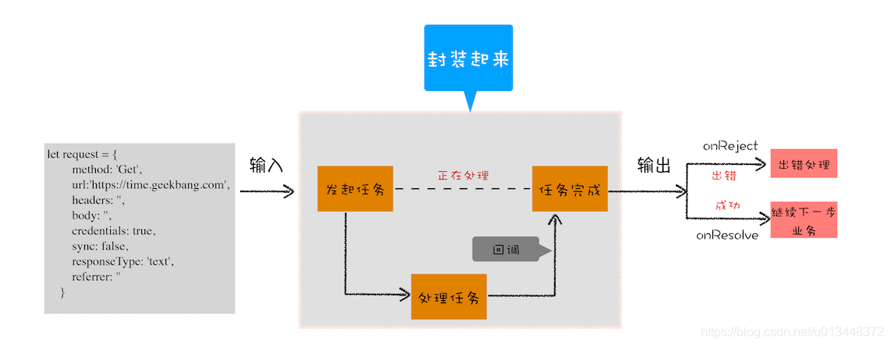

# Promise

1. 问题引入
2. Promise

## 问题引入

### 异步编程：代码逻辑不连贯


上图是一个**异步回调**的示意图，页面主线程发起一个耗时的任务，并将任务交给其他进程来处理，
页面主线程会继续执行消息队列中的任务，等该进程处理完这个任务后，会将该任务添加到渲染进程的消息队列中，等待循环系统来处理。

假设有一个XMLHTTPRequest任务：
```javascript
//执行状态
function onResolve(response){console.log(response) }
function onReject(error){console.log(error) }

let xhr = new XMLHttpRequest()
xhr.ontimeout = function(e) { onReject(e)}
xhr.onerror = function(e) { onReject(e) }
xhr.onreadystatechange = function () { onResolve(xhr.response) }

//设置请求类型，请求URL，是否同步信息
let URL = 'https://time.geekbang.com'
xhr.open('Get', URL, true);

//设置参数
xhr.timeout = 3000 //设置xhr请求的超时时间
xhr.responseType = "text" //设置响应返回的数据格式
xhr.setRequestHeader("X_TEST","time.geekbang")

//发出请求
xhr.send();
```
这段传统的五步请求方法并没有什么问题，可以正常获取结果，但是回调函数太多，造成逻辑不连贯，那么该如何解决这个问题呢？

### 封装异步代码，让处理流程变得线性



1. 把输入的请求信息全部保存在一个request对象中，里面包含了请求方式，请求地址，请求头，引用地址，同步还是异步，安全设置等信息
```javascript
//makeRequest用来构造request对象
function makeRequest(request_url) {
    let request = {
        method: 'Get',
        url: request_url,
        headers: '',
        body: '',
        credentials: false,
        sync: true,
        responseType: 'text',
        referrer: ''
    }
    return request
}
```
2. 封装请求过程， 将所有的请求细节封装在一个XFetch函数中
```javascript
//[in] request，请求信息，请求头，延时值，返回类型等
//[out] resolve, 执行成功，回调该函数
//[out] reject  执行失败，回调该函数
function XFetch(request, resolve, reject) {
    let xhr = new XMLHttpRequest()
    xhr.ontimeout = function (e) { reject(e) }
    xhr.onerror = function (e) { reject(e) }
    xhr.onreadystatechange = function () {
        if (xhr.status = 200)
            resolve(xhr.response)
    }
    xhr.open(request.method, URL, request.sync);
    xhr.timeout = request.timeout;
    xhr.responseType = request.responseType;
    //补充其他请求信息
    //...
    xhr.send();
}
```
3. 业务代码
```javascript
XFetch(makeRequest('https://time.geekbang.org'),
    function resolve(data) {
        console.log(data)
    }, function reject(e) {
        console.log(e)
    })
```

### 新的问题：回调地狱

```javascript
XFetch(makeRequest('https://time.geekbang.org/?category'),
      function resolve(response) {
          console.log(response)
          XFetch(makeRequest('https://time.geekbang.org/column'),
              function resolve(response) {
                  console.log(response)
                  XFetch(makeRequest('https://time.geekbang.org'),
                      function resolve(response) {
                          console.log(response)
                      }, function reject(e) {
                          console.log(e)
                      })
              }, function reject(e) {
                  console.log(e)
              })
      }, function reject(e) {
          console.log(e)
      })
```

造成上述情况的两个原因：
1. **嵌套调用**，下面的任务依赖上个任务的请求结果，并在上个任务的回调函数内部执行新的业务逻辑。
   这样当嵌套层次多了之后，代码的可读性就变得非常差了
2. **任务的不确定性**，执行每个任务都有两种可能的结果（成功或者失败），
   所以体现在代码中就需要对每个任务的执行结果做两次判断，这种对每个任务都要进行一次额外的错误处理的方式，
   明显增加了代码的混乱程度

## Promise

### 解决上述问题

如何解决：
1. 消灭嵌套
2. 合并多个任务的错误处理

1. 引入Promise
```javascript
function XFetch(request) {
  function executor(resolve, reject) {
      let xhr = new XMLHttpRequest()
      xhr.open('GET', request.url, true)
      xhr.ontimeout = function (e) { reject(e) }
      xhr.onerror = function (e) { reject(e) }
      xhr.onreadystatechange = function () {
          if (this.readyState === 4) {
              if (this.status === 200) {
                  resolve(this.responseText, this)
              } else {
                  let error = {
                      code: this.status,
                      response: this.response
                  }
                  reject(error, this)
              }
          }
      }
      xhr.send()
  }
  return new Promise(executor)
}
```
2. 重构业务代码
```javascript
XFetch(
    makeRequest('https://time.geekbang.org/?category')
).then(value => {
    console.log(value)
    return XFetch(makeRequest('https://www.geekbang.org/column'))
}).then(value => {
    console.log(value)
    return XFetch(makeRequest('https://time.geekbang.org'))
}).catch(error => {
    console.log(error)
})
```

Promise逻辑：
1. 在实现XFetch的时候我们引入了Promise，调用XFetch就会返回一个promise对象
2. 构建promise的时候，传入一个executor回调函数，主要业务流程都放在这个函数里面
4. 在executor函数中调用resolve函数，会触发then里的回调函数，如果reject，则会调用catch方法

Promise主要通过下面两步解决了嵌套回调的问题：
1. Promise实现了回调函数的延时绑定，具体实现就是先创建Promise对象x1，
   通过Promise的构造函数excutor来执行业务代码逻辑，然后使用x1.then来设置回调函数，示例代码如下：
```javascript
//创建Promise对象x1，并在executor函数中执行业务逻辑
function executor(resolve, reject){
    resolve(100)
}
let x1 = new Promise(executor)


//x1延迟绑定回调函数onResolve
function onResolve(value){
    console.log(value)
}
x1.then(onResolve)
```
2. 需要将回调函数onResolve的返回值穿透到最外层


### Promise手动实现

```javascript
// 写法wen
const PENDING = "PENDING";
const FULFILLED = "FULFILLED";
const REJECTED = "REJECTED";

class Bromise {
   constructor(executor) {
      this.state = PENDING;
      this.value = undefined;
      this.reason = undefined;
      this.onResolvedCallbacks = [];
      this.onRejectedCallbacks = [];

      const resolve = (value) => {
         if (this.state === PENDING) {
            this.state = FULFILLED;
            this.value = value;
            this.onResolvedCallbacks.forEach(fn => fn());
         }
      }

      const reject = (reason) => {
         if (this.state === PENDING) {
            this.state = REJECTED;
            this.reason = reason;
            this.onRejectedCallbacks.forEach(fn => fn());
         }
      }

      try {
         executor(resolve, reject);
      } catch (error) {
         reject(error);
      }
   }

   then(onFulFilled, onRejected) {
      onFulFilled = typeof onFulFilled === "function" ? onFulFilled : value => value;
      onRejected = typeof onRejected === "function" ? onRejected : err => { throw err; };

      const bromise2 = new Bromise((resolve, reject) => {
         if (this.state === PENDING) {
            this.onResolvedCallbacks.push(() => {
               setTimeout(() => {
                  try {
                     const x = onFulFilled(this.value);
                     resolveBromise(bromise2, x, resolve, reject);
                  } catch (error) {
                     reject(error);
                  }
               }, 0);
            });
            this.onRejectedCallbacks.push(() => {
               setTimeout(() => {
                  try {
                     const x = onRejected(this.reason);
                     resolveBromise(bromise2, x, resolve, reject);
                  } catch (error) {
                     reject(error);
                  }
               }, 0);
            });
         }

         if (this.state === FULFILLED) {
            setTimeout(() => {
               try {
                  const x = onFulFilled(this.value);
                  resolveBromise(bromise2, x, resolve, reject);
               } catch (error) {
                  reject(error);
               }
            }, 0);
         }

         if (this.state === REJECTED) {
            setTimeout(() => {
               try {
                  const x = onRejected(this.reason);
                  resolveBromise(bromise2, x, resolve, reject);
               } catch (error) {
                  reject(error);
               }
            }, 0);
         }
      });

      return bromise2;
   }

   catch(onRejected) {
      this.then(null, onRejected);
   }

   finally(fn) {
      return this.then(
              value => Bromise.resolve(fn()).then(() => value),
              reason => Bromise.resolve(fn()).then(() => {throw reason})
      );
   }
}

resolveBromise = (bromise2, x, resolve, reject) => {
   if (x === bromise2) {
      return reject(new TypeError("type error!"));
   }

   let hasCalled = false;

   if (x !== null && (typeof x === "object" || typeof x === "function")) {
      try {
         const then = x.then;

         if (typeof then === "function") {
            then.call(
                    x,
                    value => {
                       if (!hasCalled) {
                          hasCalled = true;
                          resolveBromise(bromise2, value, resolve, reject);
                       }
                    },
                    reason => {
                       if (!hasCalled) {
                          hasCalled = true;
                          reject(reason);
                       }
                    }
            );
         }
         else {
            resolve(x);
         }
      } catch (error) {
         if (!hasCalled) {
            hasCalled = true;
            reject(error);
         }
      }
   }
   else {
      resolve(x);
   }
}

Bromise.resolve = (bromise) => {
   if (bromise instanceof Bromise) {
      return bromise;
   }

   return new Bromise((resolve, reject) => {
      if (bromise && bromise.then && typeof bromise.then === "function") {
         setTimeout(() => {
            bromise.then(resolve, reject);
         }, 0);
      }
      else {
         resolve(bromise);
      }
   })
}

Bromise.all = (bromises) => new Bromise((resolve, reject) => {
   let bromisesResolveCounter = 0;
   const len = bromises.length;
   let bromisesResolveValues = new Array(len);

   for (let i = 0; i < len; i++) {
      bromises[i].then(
              (value) => {
                 bromisesResolveCounter++;
                 bromisesResolveValues[i] = value;
                 if (bromisesResolveCounter === len) {
                    resolve(bromisesResolveValues);
                 }
              },
              (reason) => reject(reason)
      );
   }
})

Bromise.race = (bromises) => new Bromise((resolve, reject) => {
   const len = bromises.length;
   for (let i = 0; i < len; i++) {
      Bromise.resolve(bromises[i]).then(
              value => resolve(value),
              reason => reject(reason)
      );
   }
})

const func = (value) => (resolve, reject) => {
   new Promise((resolve, reject) => {
      resolve(value);
   }).then((value) => {
      resolve(value);
   })
}

// const bromise = new Bromise(func).then((value) => {
//   console.log("then 1 " + value);
//   return 100;
// }).then((value) => {
//   console.log("then 2 " + value);
//   return 101;
// })

// bromise.then((value) => {
//   console.log("then 1.1 " + value);
//   return 2;
// })

Bromise.all([new Bromise(func(1)), new Bromise(func(2)), new Bromise(func(3))]).then((value) => console.log(value));
Bromise.race([new Bromise(func(1)), new Bromise(func(2)), new Bromise(func(3))]).then((value) => console.log(value));
```
```javascript
// A+规范
const PENDING = 'pending';
const FULFILLED = 'fulfilled';
const REJECTED = 'rejected';

class BBromise {
   constructor(executor) {
      // state 的初始状态为等待态
      this.state = PENDING;

      // 成功的值 (1.3)
      this.value = undefined;

      // 失败的原因 (1.5)
      this.reason = undefined;

      // 因为 then 在相同的 promise 可以被调用多次，所以需要将所有的 onFulfilled 存到数组 (2.2.6)
      this.onResolvedCallbacks = [];

      // 因为 then 在相同的 promise 可以被调用多次，所以需要将所有的 onRejected 存到数组 (2.2.6)
      this.onRejectedCallbacks = [];

      const resolve = value => {
         // 只有当前是 pending，才可能转换为 fulfilled
         // 并且不能再转换成其他任何状态，且必须拥有一个不可变的值
         if (this.state === PENDING) {
            this.state = FULFILLED;
            this.value = value;
            // onFulfilled 回调按原始调用顺序依次执行 (2.2.6.1)
            this.onResolvedCallbacks.forEach(fn => fn());
         }
      };

      const reject = reason => {
         // 只有当前是 pending，才可能转换为 rejected
         // 并且不能再转换成其他任何状态，且必须拥有一个不可变的原因
         if (this.state === PENDING) {
            this.state = REJECTED;
            this.reason = reason;
            // onRejectec 回调按原始调用顺序依次执行 (2.2.6.1)
            this.onRejectedCallbacks.forEach(fn => fn()); // (2.2.6.2)
         }
      };

      // 若 executor 报错，直接执行 reject()
      try {
         executor(resolve, reject);
      } catch (err) {
         reject(err);
      }
   }

   then(onFulfilled, onRejected) {
      // onFulfilled 和 onRejected 都是可选参数 (2.2.1)

      // 如果 onFulfilled 不是函数，则必须将它忽略 (2.2.1.1)
      onFulfilled =
              typeof onFulfilled === 'function' ? onFulfilled : value => value;

      // 如果 onRejected 不是函数，则必须将它忽略 (2.2.1.2)
      onRejected =
              typeof onRejected === 'function'
                      ? onRejected
                      : err => {
                         throw err;
                      };

      // 为了做到链式调用，规定每个 then 方法必须返回一个 promise，称为 promise2
      const promise2 = new BBromise((resolve, reject) => {
         // 在 promise 完成后方可调用 onFulfilled (2.2.2)
         if (this.state === FULFILLED) {
            // onFulfilled/onRejected 必须被异步调用，因此我们用延时函数模拟 (2.2.4)
            setTimeout(() => {
               try {
                  // value 作为完成函数的第一个参数 (2.2.2.1)
                  // onFulfilled 函数被记做 x (2.2.7.1)
                  const x = onFulfilled(this.value);
                  resolveBBromise(promise2, x, resolve, reject);
               } catch (e) {
                  // 如果 onFulfilled/onRejected 抛出异常，则 promise2 必须拒绝执行，并返回拒因 e (2.2.7.2)
                  reject(e);
               }
            }, 0);
         }

         // 在 promise 被拒绝后方可调用 onRejected (2.2.3)
         if (this.state === REJECTED) {
            // onFulfilled/onRejected 必须被异步调用，因此我们用延时函数模拟 (2.2.4)
            setTimeout(() => {
               try {
                  // reason 作为拒绝函数的第一个参数 (2.2.3.1)
                  // onRejected 函数被记做 x (2.2.7.1)
                  const x = onRejected(this.reason);
                  resolveBBromise(promise2, x, resolve, reject);
               } catch (e) {
                  // 如果 onFulfilled/onRejected 抛出异常，则 promise2 必须拒绝执行，并返回拒因 e (2.2.7.2)
                  reject(e);
               }
            }, 0);
         }

         if (this.state === PENDING) {
            this.onResolvedCallbacks.push(() => {
               // onFulfilled/onRejected 必须被异步调用，因此我们用延时函数模拟 (2.2.4)
               setTimeout(() => {
                  try {
                     const x = onFulfilled(this.value);
                     resolveBBromise(promise2, x, resolve, reject);
                  } catch (e) {
                     // 如果 onFulfilled/onRejected 抛出异常，则 promise2 必须拒绝执行，并返回拒因 e (2.2.7.2)
                     reject(e);
                  }
               }, 0);
            });
            this.onRejectedCallbacks.push(() => {
               // onFulfilled/onRejected 必须被异步调用，因此我们用延时函数模拟 (2.2.4)
               setTimeout(() => {
                  try {
                     const x = onRejected(this.reason);
                     resolveBBromise(promise2, x, resolve, reject);
                  } catch (e) {
                     // 如果 onFulfilled/onRejected 抛出异常，则 promise2 必须拒绝执行，并返回拒因 e (2.2.7.2)
                     reject(e);
                  }
               }, 0);
            });
         }
      });

      // 返回 promise2 (2.2.7)
      return promise2;
   }

   // catch 实际是 then 的语法糖
   catch(fn) {
      return this.then(null, fn);
   }

   finally(fn) {
      return this.then(
              value => BBromise.resolve(fn()).then(() => value),
              reason =>
                      BBromise.resolve(fn()).then(() => {
                         throw reason;
                      }),
      );
   }
}

const resolveBBromise = (promise2, x, resolve, reject) => {
   // 如果 promise 和 x 指向同一个对象，将以 TypeError 作为拒因拒绝执行 promise (2.3.1)
   if (x === promise2) {
      return reject(new TypeError('Chaining cycle detected for promise'));
   }

   // onFulfilled 和 onRejected 只能被调用一次，因此这里加一个 flag 作为判断 (2.2.2.3 & 2.2.3.3)
   let isCalled = false;

   // 如果 x 是一个对象或者是一个函数 (2.3.3)
   if (x !== null && (typeof x === 'object' || typeof x === 'function')) {
      try {
         // (2.3.3.1)
         const then = x.then;

         // 如果 then 是函数，就以 x 作为 this 调用它 (2.3.3.2 & 2.3.3.3)
         if (typeof then === 'function') {
            // 后面接收两个回调，第一个是成功的回调，第二个是失败的回调 (2.3.3.3)
            then.call(
                    x,
                    y => {
                       if (isCalled) return;
                       isCalled = true;
                       // 如果 resolveBBromise 以 y 为参数被调用，执行 [[Resolve]](promise, y) (2.3.3.3.1)
                       resolveBBromise(promise2, y, resolve, reject);
                    },
                    r => {
                       if (isCalled) return;
                       isCalled = true;
                       // 如果 rejectBBromise 以 r 为原因被调用，则以拒因 r 拒绝 promise (2.3.3.3.2)
                       reject(r);
                    },
            );
         } else {
            // 如果 then 不是个函数，则以 x 为参数执行 promise (2.3.3.4)
            resolve(x);
         }
      } catch (e) {
         if (isCalled) return;
         isCalled = true;
         // 如果取 x.then 报错，则以 e 为拒因拒绝 `promise` (2.3.3.2)
         reject(e);
      }
   }
   // 如果 then 不是个函数或者对象，则以 x 为参数执行 promise (2.3.4)
   else {
      resolve(x);
   }
};

// BBromise.resolve
BBromise.resolve = function(promises) {
   if (promises instanceof BBromise) {
      return promises;
   }
   return new BBromise((resolve, reject) => {
      if (promises && promises.then && typeof promises.then === 'function') {
         setTimeout(() => {
            promises.then(resolve, reject);
         });
      } else {
         resolve(promises);
      }
   });
};

// BBromise.reject
BBromise.reject = reason => new BBromise((resolve, reject) => reject(reason));

// BBromise.all
BBromise.all = promises => {
   return new BBromise((resolve, reject) => {
      let resolvedCounter = 0;
      let promiseNum = promises.length;
      let resolvedValues = new Array(promiseNum);
      for (let i = 0; i < promiseNum; i += 1) {
         (i => {
            BBromise.resolve(promises[i]).then(
               value => {
                  resolvedCounter++;
                  resolvedValues[i] = value;
                  if (resolvedCounter === promiseNum) {
                     return resolve(resolvedValues);
                  }
               },
               reason => {
                  return reject(reason);
               },
            );
         })(i);
      }
   });
};

//race方法
BBromise.race = promises => {
   return new BBromise((resolve, reject) => {
      if (promises.length === 0) {
         return;
      } else {
         for (let i = 0, l = promises.length; i < l; i += 1) {
            BBromise.resolve(promises[i]).then(
               data => {
                  resolve(data);
                  return;
               },
               err => {
                  reject(err);
                  return;
               },
            );
         }
      }
   });
};
```

## 参考链接

1. [浏览器工作原理(19) - 使用promise， 告别回调函数](https://blog.csdn.net/u013448372/article/details/108674747)
2. [手撕遵循 Promise/A+ 规范的 Promise](https://blog.csdn.net/weixin_34289744/article/details/91390169)