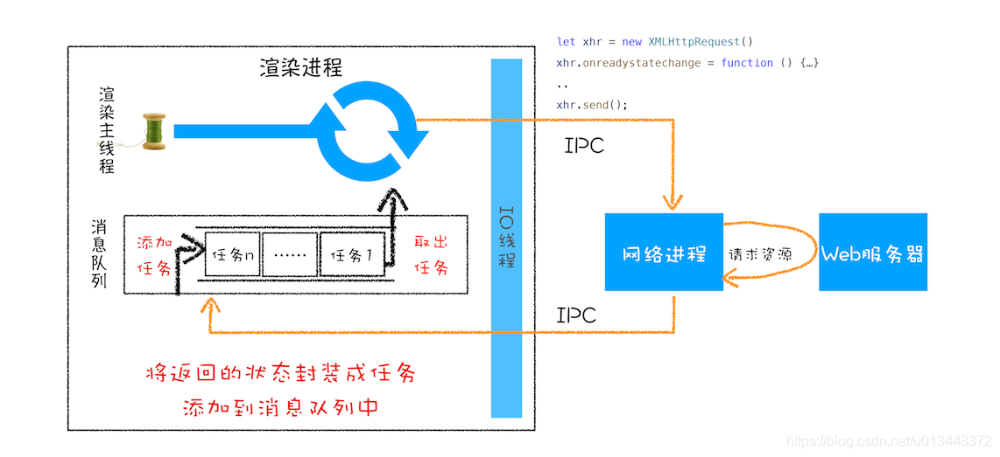

# XMLHttpRequest的实现原理

## 回调函数&&系统调用栈

### 同步回调和异步回调

```javascript
let callback = function(){
    console.log('i am do homework');
}
function doWork(cb) {
    console.log('start do work');
    cb();
    console.log('end do work');
}
doWork(callback);
```
上面的代码中，callback就是doWork函数的回调函数，并且callback是在doWork函数返回之前执行的，
这个回调过程就叫做**同步回调**

```javascript
let callback = function(){
    console.log('i am do homework');
}
function doWork(cb) {
    console.log('start do work');
    setTimeout(cb,1000);
    console.log('end do work');
}
doWork(callback);
```
这个例子中，使用了setTimeout函数让回调函数在doWork结束之后，并且延迟一秒去执行，
这次的回调是在主函数doWork之外执行的，这种回调称为**异步回调**

异步回调是指回调函数在主函数之外执行，一般有两种方式：
1. 把异步函数做成一个任务，添加到信息队列尾部；
2. 把异步函数添加到微任务队列中，这样就可以在当前任务的末尾处执行微任务了。

## XMLHttpRequest运作机制



```javascript
function GetWebData(URL){
  /**
   * 1:新建XMLHttpRequest请求对象
   */
  let xhr = new XMLHttpRequest()

  /**
   * 2:注册相关事件回调处理函数 
   */
  xhr.onreadystatechange = function () {
      switch(xhr.readyState){
        case 0: //请求未初始化
          console.log("请求未初始化")
          break;
        case 1://OPENED
          console.log("OPENED")
          break;
        case 2://HEADERS_RECEIVED
          console.log("HEADERS_RECEIVED")
          break;
        case 3://LOADING  
          console.log("LOADING")
          break;
        case 4://DONE
          if(this.status == 200||this.status == 304){
              console.log(this.responseText);
              }
          console.log("DONE")
          break;
      }
  }
  xhr.ontimeout = function(e) { console.log('ontimeout') }
  xhr.onerror = function(e) { console.log('onerror') }

  /**
   * 3:打开请求
   */
  xhr.open('Get', URL, true);//创建一个Get请求,采用异步
    
  /**
   * 4:配置参数
   */
  xhr.timeout = 3000 //设置xhr请求的超时时间
  xhr.responseType = "text" //设置响应返回的数据格式
  xhr.setRequestHeader("X_TEST","time.geekbang")

  /**
   * 5:发送请求
   */
  xhr.send();
}
GetWebData("");
```

### 1. 创建XMLHttpRequest对象

### 2. 为xhr对象注册回调函数

回调函数主要有以下几种：
1. `ontimeout`：用来监控超时请求，如果后台请求超时，该函数会被调用
2. `onerror`：用来监控出错信息，如果后台请求出错了，该函数会被调用
3. `onreadystatechange`：监控后台请求过程中的状态变化，比如监控到HTTP头加载完成的消息、
   HTTP响应体消息以及数据加载完成的消息等

### 3. 配置基础的请求信息

```javascript
xhr.open('GET', url, true)  // get请求url信息，true表示进行异步请求
xhr.timeout = 3000          // 设置超时时长
xhr.responseType = "text"   // 设置返回体格式
```

### 4. 发起请求


## 参考链接

1. [浏览器工作原理(17) - XMLHttpRequest的实现原理](https://blog.csdn.net/u013448372/article/details/108479530)