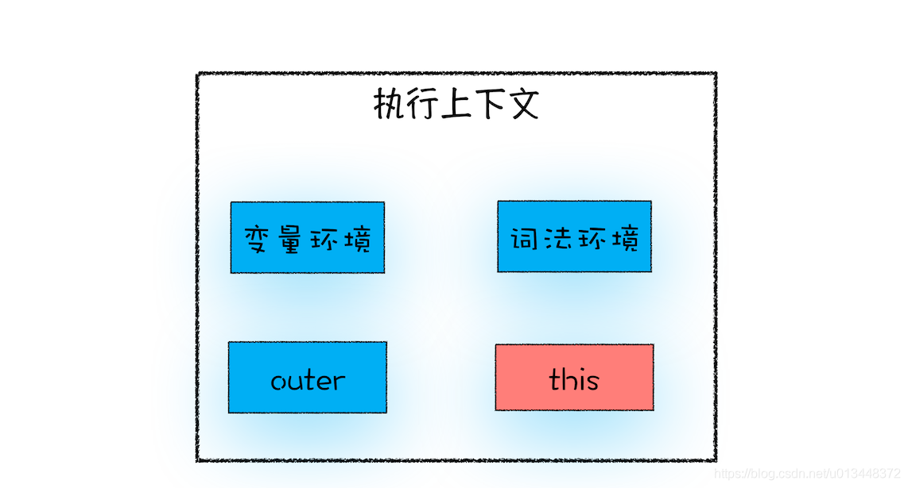

# `this`

1. `this`种类
2. 函数执行上下文中`this`绑定方式
    1. 通过函数的`call`、`apply`、`bind`方法设置
    2. 通过对象调用的方法设置
    3. 通过构造函数中设置
3. `this`的设计缺陷及应对方案
    1. 嵌套函数中的 `this` 不会从外层函数中继承
    2. 普通函数中的 `this` 默认指向全局对象 window

## 1. `this`种类



从上图中可以看出，`this`是和执行上下文绑定的，所以`this`有三种

- 全局执行上下文中的`this`，指向window对象
- 函数执行上下文中的`this`，默认指向window对象，严格模式下为undefined
- eval执行上下文中的`this`

## 2. 函数执行上下文中`this`的绑定方式

### 1. 通过函数的`call`、`apply`、`bind`方法设置

```javascript
let bar = {
    myName : "极客邦",
    test1 : 1
};
function foo(){
    console.log(this.myName);
}
foo.call(bar);
foo.apply(bar);
const foo1 = foo.bind(bar);
foo1();
```

### 2. 通过对象调用的方法设置

```javascript
var myObj = {
  name : "极客时间", 
  showThis: function(){
    console.log(this);
  }
}
myObj.showThis();
```

```javascript
var myObj = {
  name : "极客时间",
  showThis: function(){
    this.name = "极客邦"
    console.log(this)
  }
}
var foo = myObj.showThis
foo()   // 此种情况下this指向的是全局对象
```

### 3. 通过构造函数中设置

```javascript
var a;
function CreateObj(){
    this.name = "极客时间";
    a = this;
}
var myObj = new CreateObj();
console.log(myObj);
console.log(a === myObj);   // true
```

## 3. `this`的设计缺陷及应对方案

### 1. 嵌套函数中的 `this` 不会从外层函数中继承

```javascript
var myObj = {
  name : "极客时间", 
  showThis: function(){
    console.log(this);      // myObj
    function bar(){ 
        console.log(this);  // window
    }
    bar();
  }
}
myObj.showThis();
```

解决方案

1. 把`this`体系转换为作用域体系

```javascript
var myObj = {
  name : "极客时间", 
  showThis: function(){
    console.log(this);
    var self = this;
    function bar(){
      self.name = "极客邦";
    }
    bar();
  }
}
myObj.showThis();
console.log(myObj.name);
console.log(window.name);
```

2. 使用箭头函数

箭头函数并不会创建其自身的执行上下文，所以箭头函数中的`this`取决于它的外部函数

```javascript
var myObj = {
  name : "极客时间", 
  showThis: function(){
    console.log(this);
    var bar = ()=>{
      this.name = "极客邦";
      console.log(this);
    }
    bar();
  }
}
myObj.showThis();
console.log(myObj.name);
console.log(window.name);
```

### 2. 普通函数中的 `this` 默认指向全局对象 window

使用严格模式，严格模式下，函数的执行上下文中`this`值默认是`undefined`
