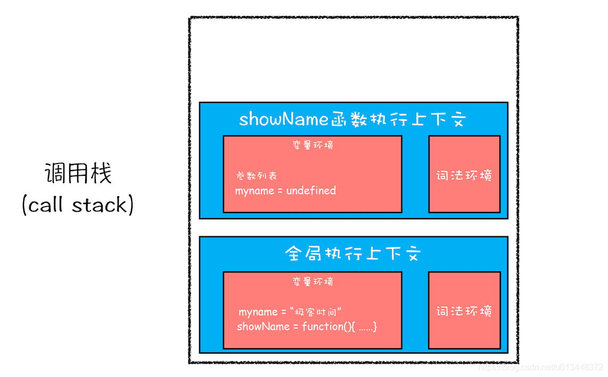
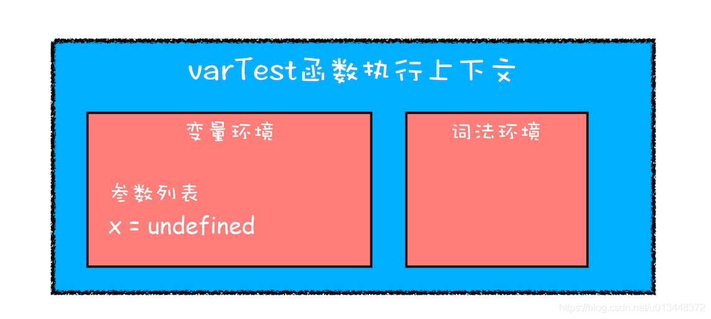
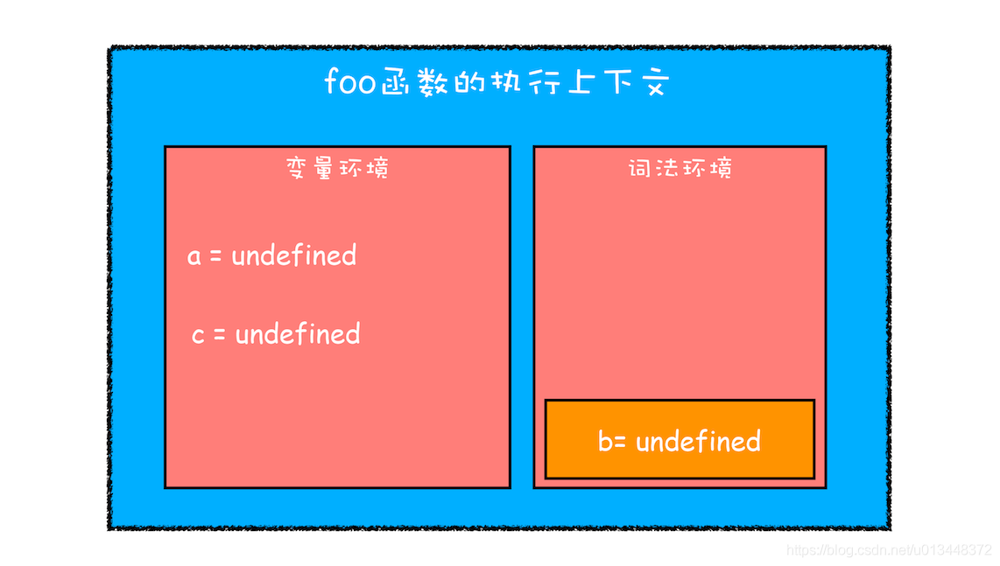
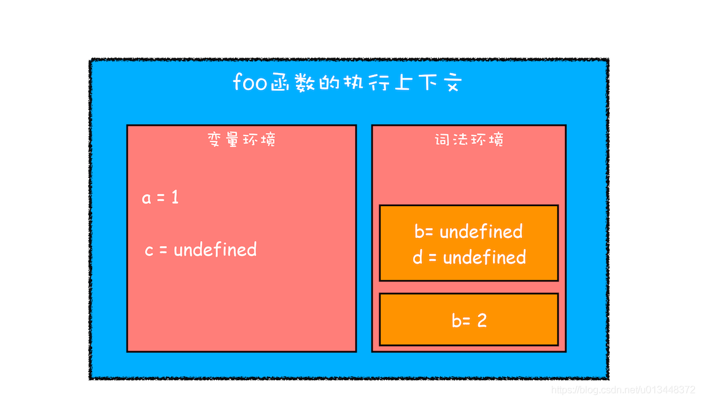
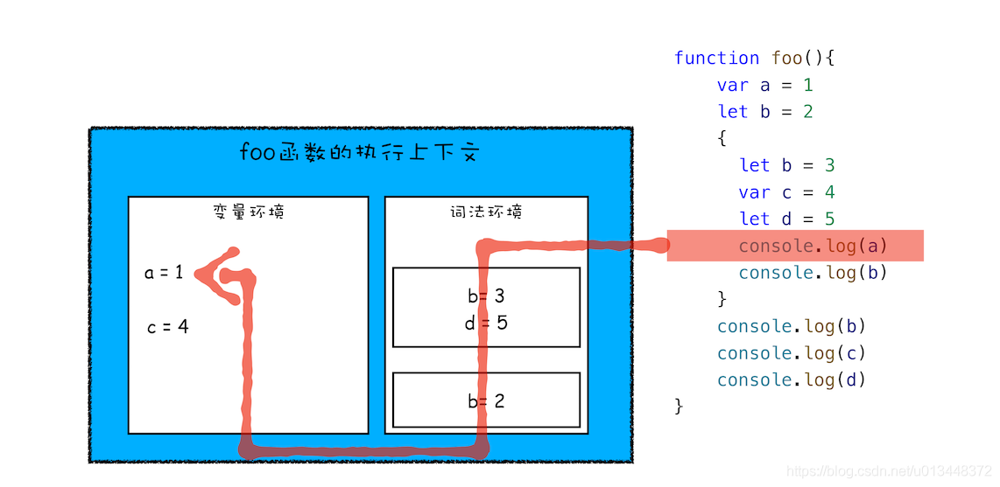

# 作用域

1. 作用域种类
    1. ES6之前
    2. ES6之后
2. 变量提升带来的问题
    1. 容易被覆盖
    2. 本应该销毁的变量没有被销毁
3. 块级作用域
    1. 示例
    2. JavaScript如何支持块级作用域

## 1. 作用域种类

### ES6之前

在ES6出现之前， JavaScript只有两种作用域：全局作用域和函数作用域
- 全局作用域：在代码中所有位置都可以访问，生命周期伴随着页面的生命周期
- 函数作用域：在函数内部才可以访问，函数执行之后，函数内部的变量会被销毁

### ES6之后

出现了块级作用域，即所有使用{}括起来 的区块

## 2. 变量提升带来的问题

1. 容易被覆盖
```javascript
var myname = "JavaScript"
function showName(){
  console.log(myname);  // undefined
  if(0){
   var myname = "HTML"
  }
  console.log(myname);  // undefined
}
showName();
```
原因是其调用栈如下图：


2. 本应该销毁的变量没有被销毁
```javascript
function foo(){
  for (var i = 0; i < 7; i++) {
  }
  console.log(i);       // 7
}
foo()
```

## 3. 块级作用域

ES6引入了`let`和`const`，它们都具有块级作用域

### 示例

- 不适用块级作用域

```javascript
function varTest() {
  var x = 1;
  if (true) {
    var x = 2;  // 同样的变量!
    console.log(x);  // 2
  }
  console.log(x);  // 2
}
```
原因是varTest的执行上下文如下图：


- 使用块级作用域

```javascript
function letTest() {
  let x = 1;
  if (true) {
    let x = 2;  // 不同的变量
    console.log(x);  // 2
  }
  console.log(x);  // 1
}
```

### JavaScript如何支持块级作用域

JavaScript将var声明的变量存储到变量环境中，而将let和const声明的变量存储到词法环境中

- 示例

```javascript
function foo(){
    var a = 1
    let b = 2
    {
      let b = 3         // break 1
      var c = 4
      let d = 5
      console.log(a)    // break 2
      console.log(b)
    }
    console.log(b) 
    console.log(c)
    console.log(d)
}   
foo()
```

初始情况下，foo函数的执行上下文：


执行到断点break 1时，foo函数的执行上下文：


执行到断点break 2时，foo函数进行变量值所有顺序：

