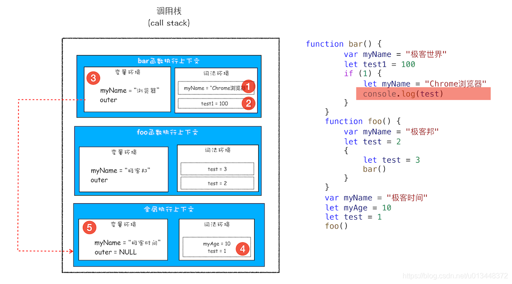
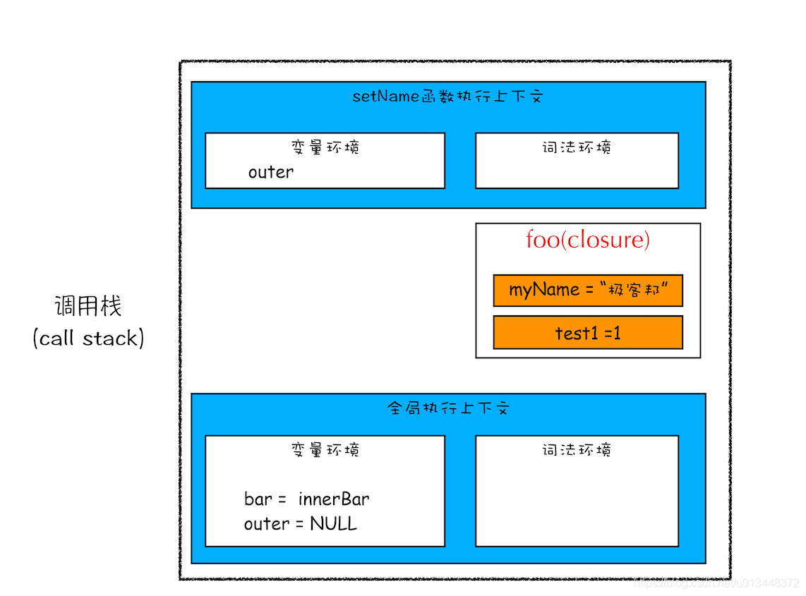

# 作用域链及闭包

1. 作用域链
2. 闭包

## 1. 作用域链

看如下代码，思考执行结果：
```javascript
function bar() {
    console.log(myName)
}
function foo() {
    var myName = "极客邦"
    bar()
}
var myName = "极客时间"
foo()
```
执行到bar内部时，调用栈如图所示


在每个执行上下文的变量环境中，都包含了一个外部引用**outer**，指向外部的执行上下文。
全局执行上下文的**outer**为`null`。  
查找变量的规则：

1. 从当前的执行上下文中找
2. 从当前执行上下文中**outer**指向的执行上下文中找，直到找到或者**outer**为`null`

上述代码的**outer**执行示意图如下：


如图所示，bar函数和foo函数执行上下文的**outer**都指向了全局执行上下文  
这是因为，执行上下文的**outer**指向是由词法作用域来确定的

**词法作用域**

词法作用域是指作用域是由代码中函数声明的位置来决定的，与调用顺序无关，只与代码的结构有关


**块级作用域中变量查找**

```javascript
function bar() {
    var myName = "极客世界"
    let test1 = 100
    if (1) {
        let myName = "Chrome浏览器"
        console.log(test)
    }
}
function foo() {
    var myName = "极客邦"
    let test = 2
    {
        let test = 3
        bar()
    }
}
var myName = "极客时间"
let myAge = 10
let test = 1
foo()
```

其查找顺序如图所示



## 2. 闭包

看如下代码，思考执行过程中调用栈的样子与执行结果
```javascript
function foo() {
    var myName = "极客时间"
    let test1 = 1
    const test2 = 2
    var innerBar = {
        getName:function(){
            console.log(test1)
            return myName
        },
        setName:function(newName){
            myName = newName    // break 2
        }
    }
    return innerBar // break 1
}
var bar = foo()
bar.setName("极客邦")  // enter 1
bar.getName()
console.log(bar.getName())
```

当执行到断点`break 1`时，其调用栈如下图所示：


根据词法作用域规则，`getName`和`setName`方法总是能访问到其外部函数`foo`中的变量，
当函数foo返回时，其执行上下文从调用栈中弹出，其调用栈如下图所示：


可以看出，虽然foo函数的执行上下文已经弹出，但由于`getName`和`setName`方法使用了foo函数内部的变量
myName和test1，所以这两个变量依旧保存在内存中

当从enter 1进入并执行到断点break 2时，调用栈如下图所示：



### 闭包概念

根据词法作用域的规则，内部函数总是可以访问外部函数中声明的变量，
当通过一个外部函数返回了一个内部函数后，即使外部函数执行结束了，
但内部函数引用的外部函数的变量依旧存储在内存中，我们把这些变量的集合称为该外部函数的闭包。

### 闭包回收

如果引用闭包的函数是一个
- 全局变量，那么闭包会一直存在知道页面关闭
- 局部变量，那么在该变量销毁后，下次执行垃圾回收时，判断这块内容不再使用，将会回收
