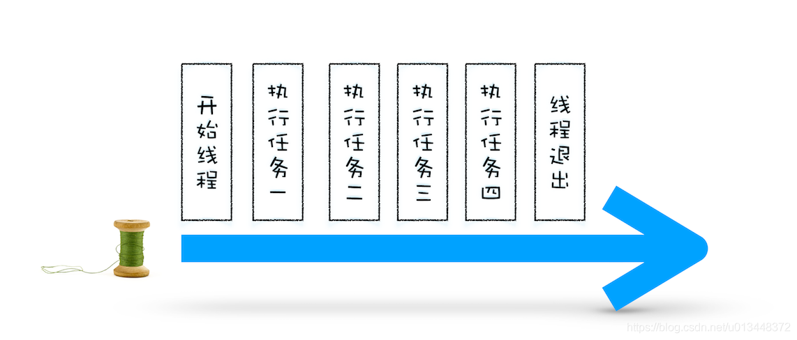
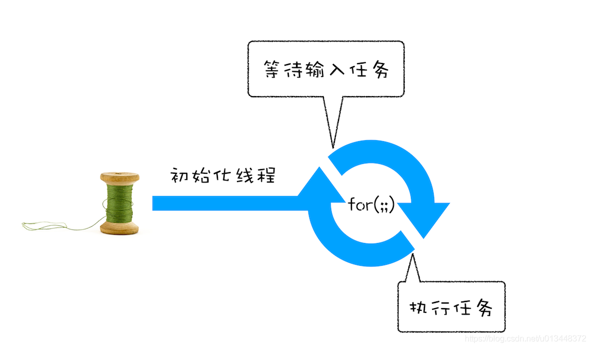
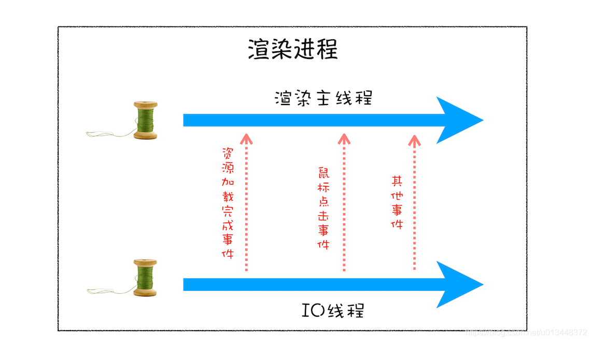
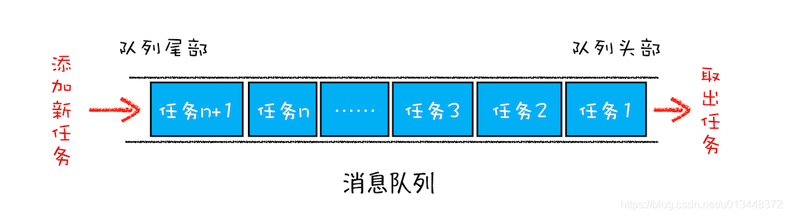
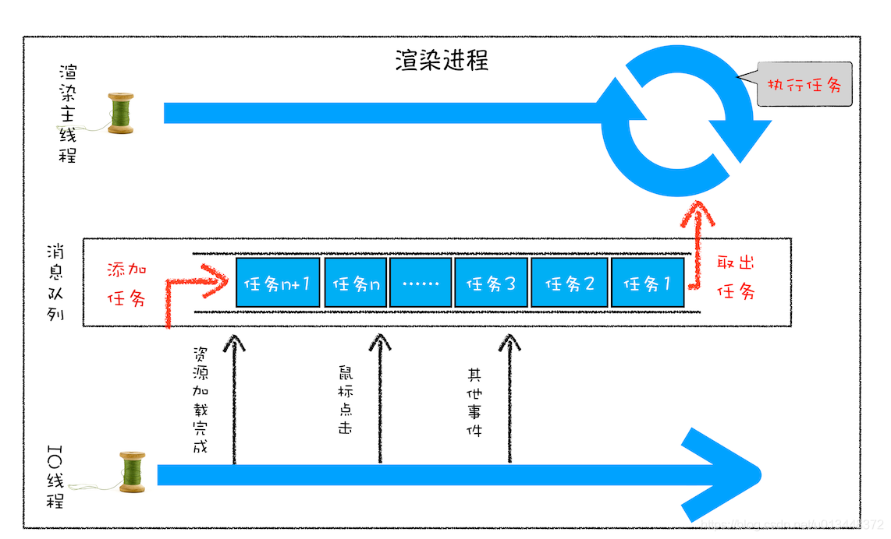
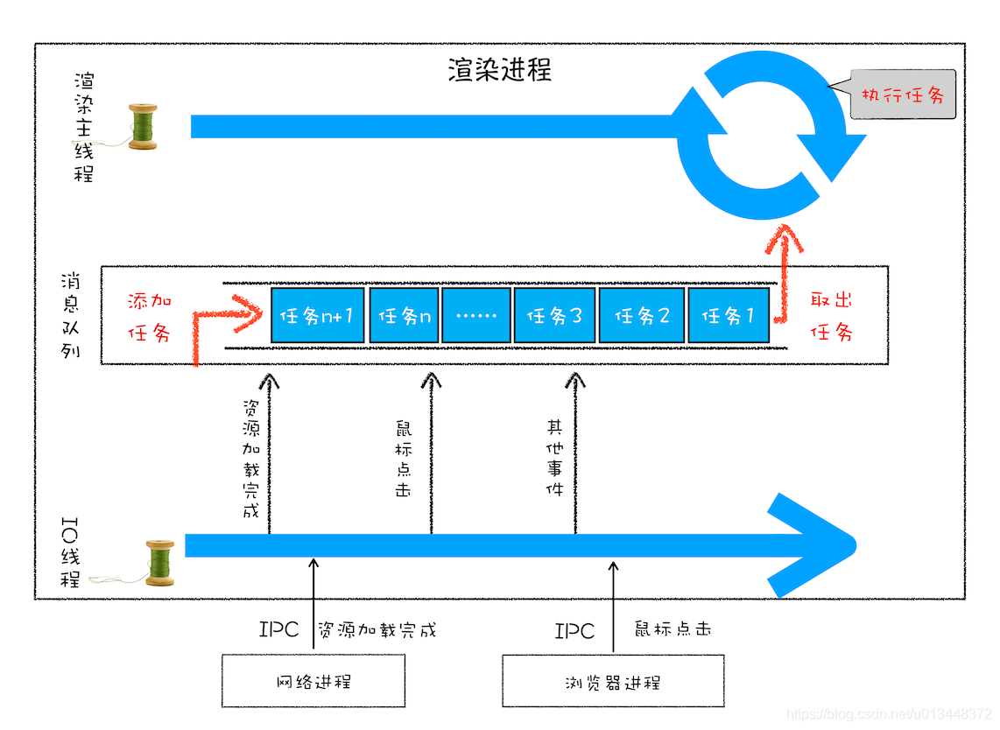

# 信息队列和事件循环

1. 单线程问题
2. 信息队列
3. 其他问题

## 1. 单线程问题

### (1). 单线程处理安排好的任务

### (2). 在线程运行过程中处理新任务

### (3). 处理其他线程发过来的任务

## 2. 信息队列

### (1). 什么是消息队列

信息队列是一种数据结构，可以存放要执行的任务。
它符合队列“先进先出”的特点，也就是说要添加任务的话，添加到队列的尾部；要取出任务的话，从队列头部去取。

### (2). 使用消息队列

改造步骤：
1. 添加一个消息队列；
2. IO 线程中产生的新任务添加进消息队列尾部； 
3. 渲染主线程会循环地从消息队列头部中读取任务，执行任务。

### (3). 处理其他线程发过来的任务

## 3. 其他问题

### (1). 信息队列中的任务类型

1. 输入事件
2. **微任务**
3. 文件读写
4. 定时器
5. JavaScript执行、dom解析、样式计算、布局计算等

这些任务事件都是在主线程中执行，所以在开发web应用时，需要思考一下事件所占用的时长，
尽量避免单个任务占用主线程时间过长的问题。

### (2). 安全退出

页面主线程执行完成之后，页面主线程会设置一个退出标志，
每次执行完一个任务时，会判断是否有退出标志，有的话就可以退出当前线程了

### (3). 页面使用单线程的缺点

1. 如何处理高优先级任务（微任务）
2. 如何解决单个任务执行时间过长问题（回调）

## 参考链接

1. [浏览器工作原理(15) - 消息队列和事件循环](https://blog.csdn.net/u013448372/article/details/108352782)