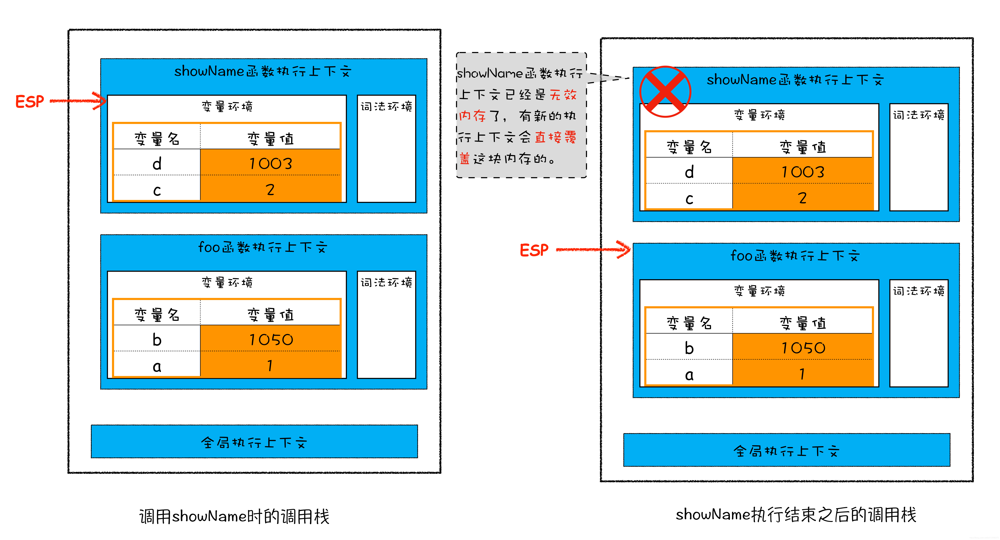
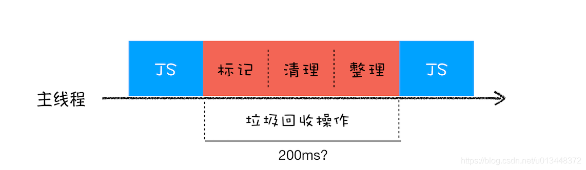
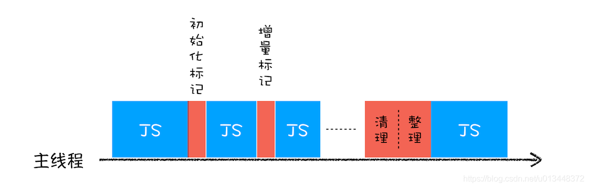

# 垃圾回收

1. 栈空间回收
2. 堆空间回收
3. 全停顿

## 1. 栈空间回收

ESP指针下移即可完成空间回收

## 2. 堆空间回收

代际假说：
1. 大部分对象在内存中存在的时间很短，也就是说对象一经分配内存，很快就变得不可访问
2. 不死的对象，活得很久

V8引擎将堆分成新生代和老生代两个区域，新生代存放生存时间短的对象，老生代存放生存时间久的对象
新生代较小，一般1-8M左右的空间，老生代较大。分别对应两个垃圾回收器
- 副垃圾回收器，主要负责新生代的垃圾回收
- 主垃圾回收器，主要负责老生代的垃圾回收

### 副垃圾回收器

**Scavenge算法**

将新生代分为两个区域，对象区域和空闲区域

新对象存入对象区域，存满后触发垃圾回收

将依旧存活的对象移入空闲区域，然后对象区域与空闲区域身份互换，这样就完成了垃圾回收与空间整理

### 主垃圾回收器

**Mark-Sweep算法**

从一组根元素开始，递归遍历，能达到的元素为**活动对象**，没有达到的为**垃圾数据**

- 标记-清除算法
- 标记-整理算法

## 3. 全停顿

由于 JavaScript 是运行在主线程之上的，一旦执行垃圾回收算法，需要将正在执行的 JavaScript 脚本暂停下来，
待垃圾回收完毕后再恢复脚本执行。我们把这种行为叫做全停顿（Stop-The-World）

为了降低老生代的垃圾回收而造成的卡顿，V8 将标记过程分为一个个的子标记过程，
同时让垃圾回收标记和 JavaScript 应用逻辑交替进行，直到标记阶段完成，
我们把这个算法称为增量标记（Incremental Marking）算法。

## 参考链接

1. [浏览器工作原理(13) -垃圾回收，垃圾数据是如何自动回收的？](https://blog.csdn.net/u013448372/article/details/108189659)