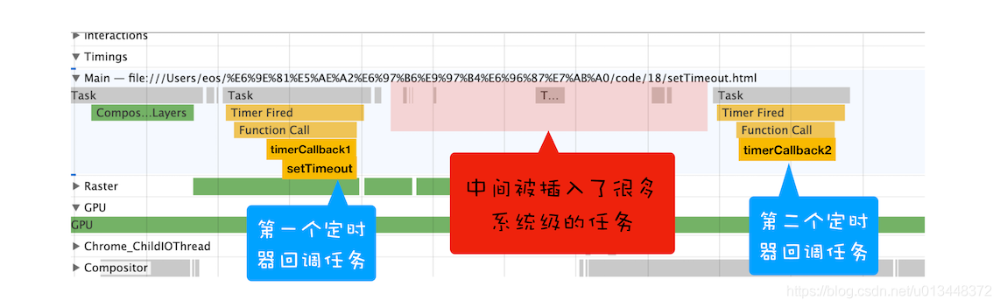
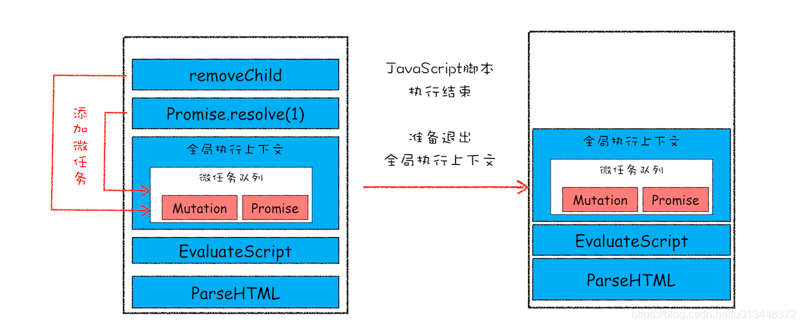
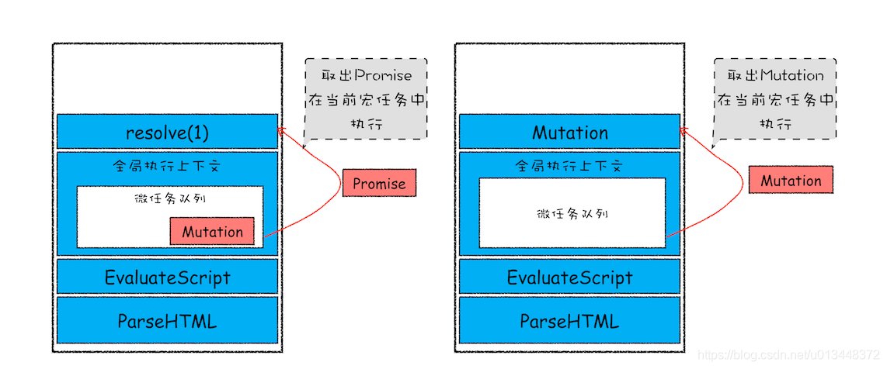

# 宏任务和微任务

## 宏任务

页面中大部分任务都是在主线程上执行，主要有：
1. 渲染事件（解析DOM，计算布局，绘制）
2. 用户交互事件
3. JavaScript脚本执行
4. 网络请求、文件读取

为了协调这些任务，页面进程引入了信息队列和事件循环机制，渲染进程内部会维护多个信息队列，
比如延迟执行队列和普通信息队列，主线程采用for循环，不断取任务并执行，这些信息队列中的任务就叫**宏任务**

采用事件循环系统来执行信息队列中的任务，大致步骤如下：
1. 先从多个信息队列中选出一个最老的任务，这个任务称为oldestTask
2. 然后循环系统记录任务开始时间，并把这个oldestTask设置为当前正在执行的任务
3. 当任务执行完成之后，删除当前正在执行的任务，并从对应的信息队列中删除掉这个oldestTask
4. 最后统计执行完成的时长等信息

JavaScript 代码不能准确掌控任务要添加到队列中的位置，控制不了任务在消息队列中的位置，所以很难控制开始执行任务的时间

```javascript
function timerCallback2(){
    console.log(2)
}
function timerCallback1(){
    console.log(1)
    setTimeout(timerCallback2,0)
}
setTimeout(timerCallback1,0)
```
在这段代码中，目的是想通过 setTimeout 来设置两个回调任务，并让它们按照前后顺序来执行，中间也不要再插入其他的任务



## 微任务

异步回调主要有两种方式：
1. 把异步回调函数封装成一个宏任务，添加到消息队列尾部，当循环系统执行到该任务的时候执行回调。
   `setTimeout`和`XMLHttpRequest`都是这种方式
2. 第二种方式的执行时机是在主函数执行结束之后、当前宏任务结束之前执行回调函数，这通常都是以微任务的形式体现

- 概念：**微任务**就是一个需要异步执行的函数，执行时机是在主函数执行结束之后，当前宏任务结束之前
- 微任务产生的方式：
    1. 使用`MutationObserver`监控某个DOM节点，再通过JavaScript来修改这个节点
    2. 使用`Promise`，当调用`Promise.resolve()`或者`Promise.reject()`的时候，会产生微任务
- 微任务执行方式




全局上下文退出之前，要检查微任务队列中是否存在微任务，有则取出执行，无则退出全局执行上下文

**结论**

- 微任务和宏任务是绑定的，每个宏任务在执行时，会创建自己的微任务队列
- 微任务的执行时长会影响到当前宏任务的时长
- 在一个宏任务中，分别创建一个用于回调的宏任务和微任务，无论什么情况下，微任务都早于宏任务执行

## 参考链接

1. [浏览器工作原理(18) - 宏任务和微任务的概念](https://blog.csdn.net/u013448372/article/details/108539382)
