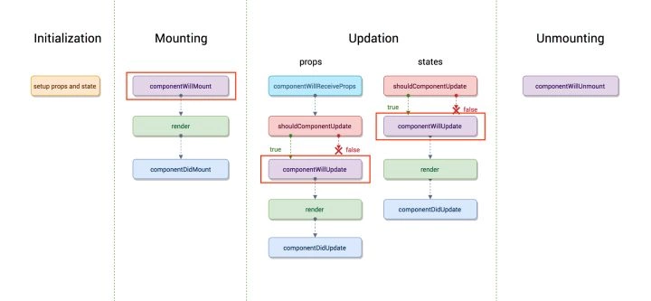
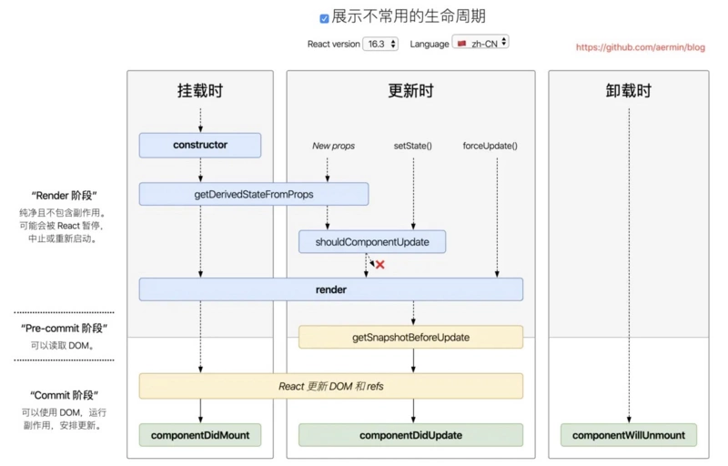
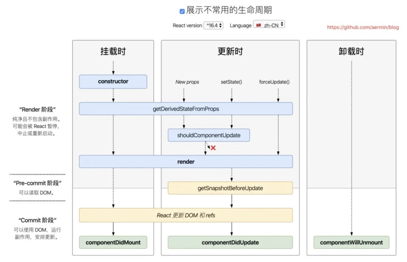

# 16.3-16.4版本更新

1. React16新的生命周期弃用了componentWillMount、componentWillReceiveProps，componentWillUpdate
2. 新增了getDerivedStateFromProps、getSnapshotBeforeUpdate来代替弃用的三个钩子函数（componentWillMount、componentWillReceiveProps，componentWillUpdate）
3. React16并没有删除这三个钩子函数，但是不能和新增的钩子函数（getDerivedStateFromProps、getSnapshotBeforeUpdate）混用，React17将会删除componentWillMount、componentWillReceiveProps，componentWillUpdate
4. 新增了对错误的处理（componentDidCatch）

旧的生命周期

16.3版本生命周期

16.4+版本生命周期

